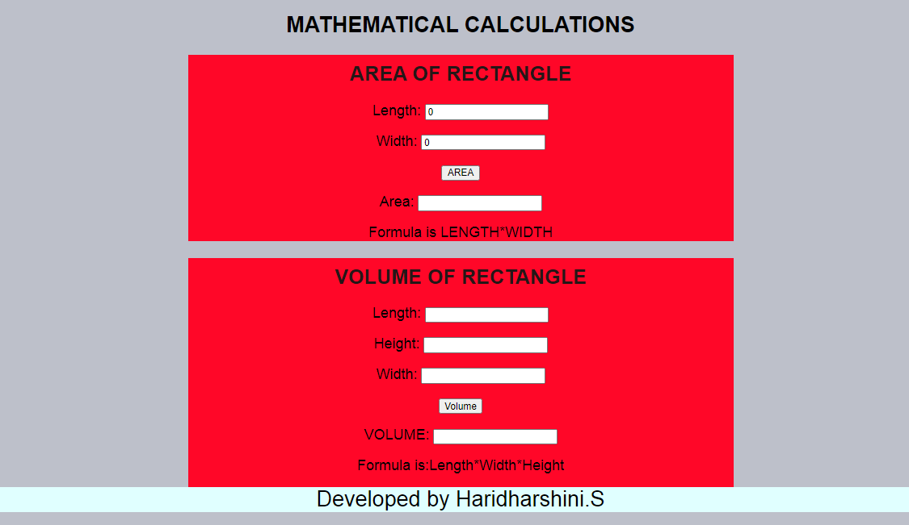

# AngularCalculation

# Web Page for Mathematical Calculations using Angular

## AIM:
To design a dynamic website to perform mathematical calculations using Angular Framwork

## DESIGN STEPS:

### Step 1:

Requirement collection.

### Step 2:

Creating the layout using HTML and CSS in component.html file

### Step 3:

Write typescript to perform the calculations.

### Step 4:

Validate the layout in various browsers.

### Step 5:

Validate the HTML code.

### Step 6:

Publish the website in the given URL.

## PROGRAM :

### index.html:
```
<!doctype html>
<html lang="en">
<head>
  <meta charset="utf-8">
  <title>Mathcalculations</title>
  <base href="/">
  <meta name="viewport" content="width=device-width, initial-scale=1">
  <link rel="icon" type="image/x-icon" href="favicon.ico">
</head>
<body>
  <app-root></app-root>
</body>
</html>
```
### AreaRectangle.component.ts:
```
import { Component } from "@angular/core";

@Component({
    selector:'Rectangle-Area',
    templateUrl:'./AreaRectangle.component.html'
})

export class AreaComponent{
    length:number;
    width:number;
    area:number;
    constructor(){
        this.length= 0
        this.width = 0
        this.area = this.length*this.width;
    }

    onCalculatearea()
    {
        this.area = this.length*this.width
    }
}
```
### AreaRectangle.component.html:
```
<div>
    Length:<input type="text" [(ngModel)]="length">Meters<br/>
    <br/>
    width:<input type="text" [(ngModel)]="width">Meters<br/>
    <br/>
    <input type = "button" (click)="onCalculatearea()" value="Calculate Area"><br/>
    <br/>
    Area:<input type="text" readonly value="0" [value]="area">Meter<sup>2</sup>
    <h1>Formula is LENGTH*WIDTH<H1>
</div>
```
### AreaVolume.component.ts:
```
import { Component } from "@angular/core";

@Component({
    selector:'Rectangle-Volume',
    templateUrl:'./AreaVolume.component.html'
})

export class VolumeComponent{
    clength:number;
    cheight:number;
    cwidth:number;
    volume:number;
    constructor(){
        this.clength = 0;
        this.cheight = 0;
        this.cwidth= 0;
        this.volume = this.clength*this.cwidth*this.cheight;
    }
    onCalculateVolume()
    {
        this.volume = this.clength*this.cwidth*this.cheight;
    }
}
```
### AreaVolume.component.html:
```
<div>
    Length:<input type="text" [(ngModel)]="clength">Meters<br/>
    <br/>
    Width:<input type="text" [(ngModel)]="cwidth">Meters<br/>
    <br/>
    Height:<input type="text" [(ngModel)]="cheight">Meters<br/>
    <br/>
    <input type = "button" (click)="onCalculateVolume()" value="Calculate Volume"><br/>
    <br/>
    Volume:<input type="text" readonly value="0" [value]="volume">Meter<sup>3</sup>
    <h1>Formula is LENGTH*WIDTH*HEIGHT
</div>
```
### app.module.ts:
```
import { NgModule } from '@angular/core';
import { FormsModule } from '@angular/forms';
import { BrowserModule } from '@angular/platform-browser';

import { AppComponent } from './app.component';
import { CuboidComponent } from './AREA/AreaRectangle.component';
import { ParallelogramComponent } from './VOLUME/VolumeRectangle.component';


@NgModule({
  declarations: [
    AppComponent,AreaComponent,VolumeComponent
  ],
  imports: [
    BrowserModule,FormsModule
  ],
  providers: [],
  bootstrap: [AppComponent]
})
export class AppModule { }
```
### app.module.html:
```
style>
     * {
  box-sizing: border-box;
  font-family: Arial, Helvetica, sans-serif;
    }
    body {
    background-color:rgb(189, 192, 202);
    }
    .container {
    width: 1000px;
    margin-left: auto;
    margin-right: auto;
    
    }
    .content {
        display: block;
        width: 100%;
        background-color: #ff0728;
        max-height: 300px;
        max-width: 750px;
        margin-left: auto;
        margin-right: auto;
    } 
    .content2{
        display: block;
        width: 100%;
        background-color: #ff0728;
        max-width: 750px;
        margin-left: auto;
        margin-right: auto;
    }
    h1{
        text-align: center;
        font-size: 30px;
        color: black;
    }
    h2{
        text-align: center;
        font-size: 28px;
        padding-top: 10px;
        color: rgb(36, 23, 23);
    }
    .formelement{
        text-align: center;
        font-size:20px;

    }
    .footer{
        display:block;
        width:100%;
        height:44r4r0px;
        background-color:lightcyan;
        text-align:center;
        margin:0px 0px 0px 0px;
        color:#000000;
        font-size:30px;
    }
    </style>

<body>
    <div class="container">
    <h1>Math Calculations</h1>
    <div class="content">
        <h2><u>Area of Rectangle</u></h2>
        <Rectangle-Area class="formelement"></Rectangle-Area>
    </div>
    <div class="content1">
        <h2><u>Volume of Rectangle</u></h2>
        <Rectangle-Volume class="formelement"></Rectangle-Volume>
    </div>
    <div class="footer">
        Developed by Haridharshini.S
    </div>
    </div>

</body>
```
## OUTPUT:


## Result:
Thus a Mathmetical calculation website is created using Angular